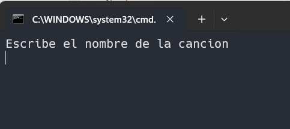

# Utafly

Program to testing about apis, you could search any song and get his information

## Requirements
I use 

- Gradle
- Java
- Musixmatch api

### How to work

The program work inside terminal, ask you if you want search song



Here you could search any song 

 

Then app list you the available songs and you should select one to show information about the song

 


## Build
to build this project you should clone the repo
```
git clone https://github.com/tsukitaro/Utafly
cd Utafly
```

Here you need create a config.properties file to store the api key, I use the Musixmatch api.
Therefore you should request one api key in the site [Musixmatch Developer](https://developer.musixmatch.com/)

When you have the api you could store in config.properties with the key and value
```
api.key=API_KEY_VALUE
```

then you could execute gradle build
```
gradle build
```

## License

This project is licensed under the terms of the GNU GLP v3 License. See the [LICENSE](./LICENSE.md) file for details.
